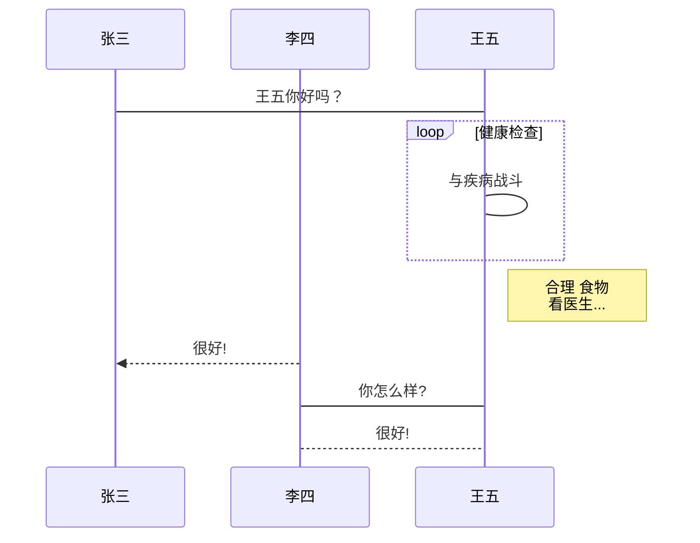

- 👋 👌🎁🎀💚💙💤🕉⛎🈚🈶🈹🈵🈴㊗㊙🉐🕗🕘👨‍🦰👩‍🦰😎😎👩‍🦰😁😎😂🤣😃😄😅😆🎆🎇🎈🎄🎍🎞🎁🎁🎭🖼🎪 Hi, I’m @chenhui9111
- 👀 I’m interested in ...
- 🌱 I’m currently learning ...
- 💞️ I’m looking to collaborate on ...
- 📫 How to reach me ...

<!---
chenhui9111/chenhui9111 is a ✨ special ✨ repository because its `README.md` (this file) appears on your GitHub profile.
You can click the Preview link to take a look at your changes✔
--->

这是测试
====
小标题测试
--------
# 我是陈晖
## 我是陈晖
##### 我是陈晖
段落末尾加空格    

*斜体*  
**粗体**  
_xieti _  
__xittiR__  
***  

[^RUNOOB]kjkjkjkjkjkj

* 项目1
* 项目2
* 项目3
    + 项目3.1
    + 项目3.2
      - 项目3.2.1
      - 项目3.2.2
> 1. 项目4
> 2. 项目5

    PHP echo 'runoob';
    function test(1234567){
    echo 'test'
    }
    
< 123456
[click me](https://www.runoob.com)

|表列1|别列2|表列3|
|:---|:---|:---|
|陈|王|李|

|col|col|col|
|---:|---:|---:|
|liu|mail|li|

$f(x) = sin(x) +12$
$$\sum_{n=1}^{100} n$$

